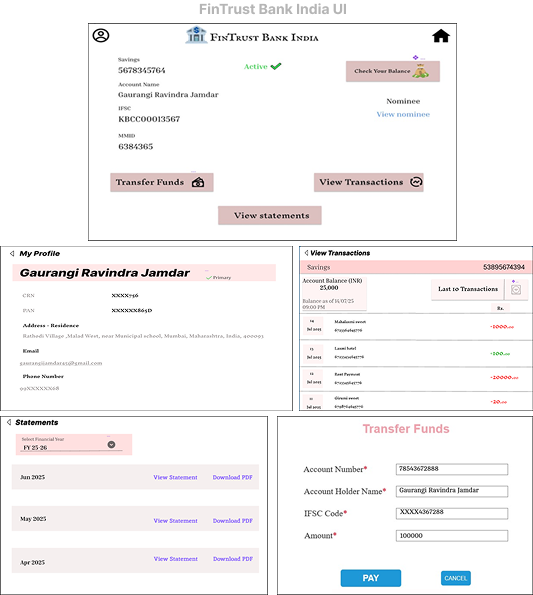

# 🏦 FinTrust Bank India – Digital Banking Transformation

## 📌 Project Summary
This repository contains the **end-to-end Business Analysis documentation** for FinTrust Bank’s digital transformation initiative — moving from traditional branch-based banking to a **user-centric online banking solution**.

The project highlights the complete BA lifecycle: identifying business problems, defining requirements, documenting user stories, designing wireframes, and visualizing process flows.

---

## ❗ Current Challenges
FinTrust Bank currently offers only **in-branch services**. Customers are required to visit the branch for:

- New account registration  
- Checking balances  
- Fund transfers  
- Accessing transaction history  

This leads to:
- Long wait times and slower services  
- High manual workload and operational costs  
- Limited service hours  
- Decreased customer satisfaction  
- Increased risk of losing customers to digital-native banks  

---

## 💡 Strategic Solution
To resolve these pain points, FinTrust Bank is launching a **secure, responsive online banking portal** that will:

- Allow 24/7 digital access to banking services  
- Enable self-service account management  
- Facilitate fund transfers and statement downloads  
- Seamlessly integrate with the bank’s existing core and authentication systems  

This will streamline operations and significantly enhance customer experience.

---

## 📂 Repository Contents

| # | Folder/File | Description |
|---|-------------|-------------|
| 1 | [**1_BRD**](1_BRD/) | Business Requirements Document – Background, objectives, and high-level business needs |
| 2 | [**2_FRD**](2_FRD/) | Functional Requirements Document – Detailed descriptions of system functionality |
| 3 | [**3_User_Stories**](3_User_Stories/) | Sprint-wise Agile user stories with clear acceptance criteria |
| 4 | [**4_Wireframes**](4_Wireframes/) | UI mockups for all key pages and workflows |
| 5 | [**5_Process_Flows**](5_Process_Flows/) | Diagrams representing As-Is and To-Be process states |

---

## 🧾 Key Business Requirements

### 🔐 Digital Profile Management
- User registration  
- Login functionality  
- Set/reset password  
- Change password  

### 📊 Dashboard & Account Overview
- View profile and personal details  
- Check account balance  
- Access account summary  
- Track recent transactions  

### ⚙️ Account Management
- Edit profile details  
- View/download bank statements  
- Manage banking preferences  

### 💸 Funds Transfer
- Initiate fund transfers  
- View transfer history and status  

---

## 🛠 Tools & Methodologies

- **Documentation:** Microsoft Word  
- **UI/UX Design:** Figma / Balsamiq / Axure  
- **Process Diagrams:** Lucidchart / MS Visio  
- **BA Techniques:** Elicitation, Use Case Modeling, User Story Mapping  

---

## 🖼️ UI Wireframe Samples

### 🌐 Main Landing Page  
.png)

### 👥 Registration Form  
.png)

### 💳 Transfer Funds Interface  
.png)

---

## 🔄 Process Flow Visuals

### 🔍 As-Is Process Flow  

### 🚀 To-Be Process Flow  

---

## 🔑 Key Features of the Digital Platform

- 24x7 access to banking services  
- Self-managed registration and login  
- Seamless, secure fund transfers  
- Real-time access to statements and summaries  
- Intuitive and mobile-friendly design  

---

## 👩‍💼 About This Project
This is a **portfolio project** developed as part of my **Business Analyst career journey**, showcasing my ability to manage and deliver comprehensive BA documentation for a real-world banking scenario.

**Author:** GAURANGI JAMDAR  
**LinkedIn:** [GAURANGI JAMDAR](https://www.linkedin.com/in/gaurangi-jamdar-538b4b379)  
**Email:** gaurangijamdar.ba@gmail.com
